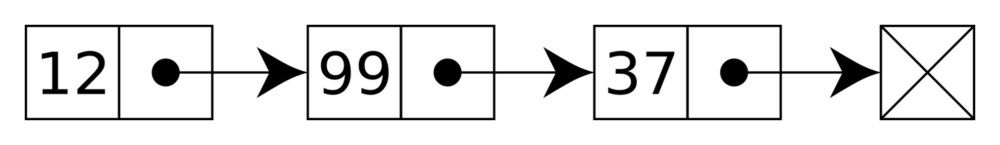

[⬅ Структуры данных](../dataStructures.md)  

# Связный список

> Связанный список - это последовательность узлов, которые содержат два поля: данные и ссылку на следующий узел. Последний узел связан с ограничителем, используемым для обозначения конца списка.

### 🧵 Основные операции связного списка:
| Операция           | Описание                                                       | Сложность     |
|--------------------|----------------------------------------------------------------|---------------|
| `insertAtHead(x)`  | Вставить элемент `x` в начало списка                           | **O(1)**      |
| `insertAtTail(x)`  | Вставить элемент `x` в конец списка (если есть указатель на хвост) | **O(1)** / **O(n)** |
| `delete(x)`        | Удалить первый найденный элемент со значением `x`              | **O(n)**      |
| `search(x)`        | Найти элемент со значением `x`                                 | **O(n)**      |
| `isEmpty()`        | Проверить, пуст ли список                                      | **O(1)**      |
***

### 📌 Задачи (от простых к сложным):

#### 1. 🔁 Reverse Linked List
**Задача** - **[LeetCode #206](https://leetcode.com/problems/reverse-linked-list/description/)**  
**Описание**: Учитывая начало односвязного списка, переверните список и верните перевернутый список.  
**Цель**: Освоить перебор нод связного списка.

#### 2. 🔀 Merge Two Sorted Lists
**Задача** - **[LeetCode #21](https://leetcode.com/problems/merge-two-sorted-lists/description/)**  
**Описание**: Вам предоставлены заголовки двух отсортированных связанных списков list1 и list2.
Объедините два списка в один отсортированный список. Список должен быть составлен путем объединения узлов первых двух списков.
Верните заголовок объединенного связанного списка.  
**Цель**: Освоить одновременный перебор 2 связных списков.

#### 3. 🧹 Remove Duplicates from Sorted List
**Задача** - **[LeetCode #83](https://leetcode.com/problems/remove-duplicates-from-sorted-list/description/)**  
**Описание**: Учитывая начало отсортированного связанного списка, удалите все дубликаты, чтобы каждый элемент отображался только один раз.
**Цель**: Освоить удаление нод из связного списка.

#### 4. 🧮 Add Two Numbers
**Задача** - **[LeetCode #2](https://leetcode.com/problems/add-two-numbers/description/)**  
**Описание**: Вам предоставлены два непустых связанных списка, представляющих два неотрицательных целых числа. Цифры хранятся в обратном порядке, и каждый из их узлов содержит одну цифру. Сложите два числа и верните сумму в виде связанного списка.
**Цель**: Дополнительная практика.

***
[⬅ Очередь](./queue.md)